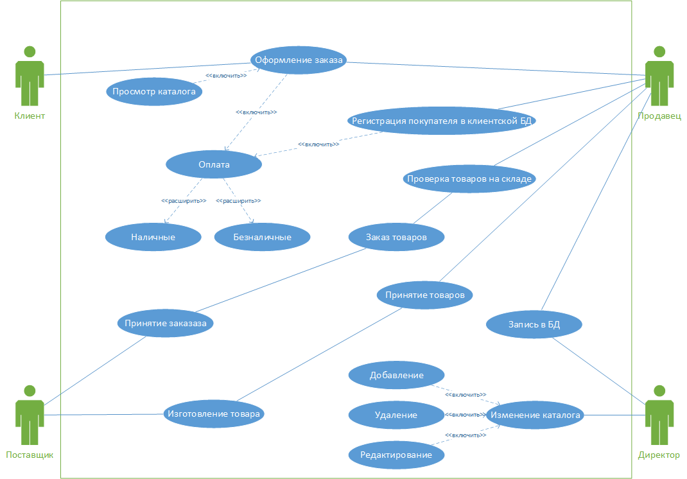

<table style="width: 100%;">
  <tr>
    <td style="text-align: center; border: none;"> 
        Министерство образования и науки РФ <br/>
        ГБПОУ РМЭ "Йошкар-Олинский Технологический колледж 
    </td>
  </tr>
  <tr>
    <td style="text-align: center; border: none; height: 45em;">
        <h2>
            Курсовой проект <br/>
            "Проектирование и разработка информационных систем" <br/>
            группа И-41
        <h2>
    </td>
  </tr>
  <tr>
    <td style="text-align: right; border: none; height: 20em;">
        <div style="float: right;" align="left">
            <b>Разработал</b>: <br/>
            Даутов Дамир Ильдарович <br/>
        </div>
    </td>
  </tr>
  <tr>
    <td style="text-align: center; border: none; height: 1em;">
        г.Йошкар-Ола, 2021
    </td>
  </tr>
</table>

<div style="page-break-after: always;"></div>

# Содержание

* [Введение](#Введение)
* [Структурный системный анализ](#Структурный-системный-анализ)
* [Разработка и реализация проекта базы данных](#Разработка-и-реализация-проекта-базы-данных)
* [Практическая часть](#Практическая-часть)
* [Заключение](#Заключение)

# Введение

В современном обществе информация стала полноценным ресурсом производства, важным элементом социальной и политической жизни общества. Качество информации определяет качество управления.

В последнее время все больше предприятий сталкиваются с проблемой улучшения управляемости компании: улучшение контроля и ускорение бизнес- процессов, улучшение возможности их отслеживания, оптимизация рабочего времени, экономия трудозатрат, повышение производительности труда и так далее. Единственным способом реализации подобных задач является внедрение информационной системы.

Применение современных информационных технологий имеет важное значение для оптимизации внутренних процессов организации, оперативного доведения информации до исполнителей, улучшения взаимодействия подразделений и отдельных исполнителей в процессе работы с документами, контроля исполнения документов и поручений, поиска информации и определения стадии исполнения документов и их местонахождения, то есть, в конечном счете, способствует более оперативному и качественному решению вопросов, которым посвящены документы. Главное при этом - улучшение взаимодействия всех подразделений организации, повышение управляемости, а также достижение более высокой оперативности в работе.
Для успешного и эффективного функционирования практически любой системы необходимы ведение контроля, анализа и внедрение автоматизации для отдельных процессов или системы в целом. Автоматизация позволяет повысить производительность и качество системы, оптимизировать процессы управления, снизить затраты.
Целью данной курсовой работы является проектирование информационной системы сети компьютерного оборудования, которая позволила бы значительно улучшить качество обслуживания клиентов и упростить процессы оформления продаж компьютерных оборудований, а также достичь максимального результата работы сети магазинов компьютерного оборудования.
Для описания предметной области и проектируемой системы будем использовать диаграммы UML. Язык моделирования UML предоставляет выразительные средства для создания визуальных моделей и обладает рядом значимых преимуществ:

•	UML объектно-ориентирован, в результате чего методы описания результатов анализа и проектирования семантически близки к методам программирования на современных объектно-ориентированных языках;

•	UML позволяет описать систему практически со всех возможных точек зрения и разные аспекты поведения системы;

•	Диаграммы UML сравнительно просты для чтения после быстрого ознакомления с его синтаксисом;

•	UML получил широкое распространение и динамично развивается.

Актуальность темы определяется тем, что информационные системы составляют в настоящее время основу компьютерного обеспечения информационных процессов, входящих практически во все сферы человеческой деятельности.

В настоящее время, несмотря на повышение компьютеризации общества, в общежитии до сих пор нет средств, позволяющих в достаточной мере автоматизировать процесс ведения документации и отчетности.

О своевременности и актуальности рассматриваемой проблемы говорит тот факт, что большую часть своего времени, заведующая общежития тратит на оформление различной документации и отчетов.

Выше изложенное в целом определило цель исследования: повышение эффективности работы, за счет разработки и внедрения информационной системы.
Данная информационная система предназначена для хранения информации о людях, находящихся в базеданных, с возможностью внесения данных, выборки и изменения данных, вывода информации в необходимом формате.

Объект исследования: Сведения о телефонных абонентах “Prilozenie”.

Предмет исследования: информационная система, автоматизирующая работу телефонного справочника “Prilozenie”.

В соответствии с поставленной целью в проекте определены следующие задачи исследования:

1.	На основе теоретического анализа литературы и Internet-источников произвести анализ предметной области магазина.

2.	Провести	функционально-ориентированное	проектирование информационной системы.

3.	Разработать инфологическую модель информационной системы.

4.	Спроектировать логическую структуру информационной системы.

5.	Разработать физическую структуру информационной системы.

6.	Разработать запросы и отчеты к информационной системе.

7.	Разработать интерфейс БД.

8.	Создать руководство пользователя.

# Структурный системный анализ

1.1. Описание предметной области

Для наиболее эффективного производства в любой организации возникает проблема управления данными. Автоматизация позволяет хранить, структурировать и систематизировать большие объемы данных.

Итак, при разработке информационной системы необходимо решить следующие проблемы:

Во-первых, создание электронного каталога списка телефонных абонентов.

Во-вторых, разработать сервис поиска абонентов в каталоге.

Увеличение скорости и качества поиска абонентов (на первом этапе) требует разработки и внедрения такой информационной системы, которая предоставляла бы анализ информации о телефонных списков.

В-третьих, редактирование каталога. Спустя некоторое время данные теряют свою актуальность, что создает новую проблему. Необходимо создать такую систему, которая позволяет менять данные о абонентах.

При разработке информационной системы «Prilozenie» было проведено обследование деятельности телефонных списков.

Таким образом, в результате обследования предметной области были определены следующие входные данные:

–	информация о абонентах,

–	информация о городе,

–	информация  email,

–	информация дом и улица.


Для создания информационной модели списка телефонных абонентов необходимо осуществить формальное описание его работы. Изучение информации о абонентах является первым шагом в изучении процессов работы справочника.

Для описания предметной области и проектируемой системы будем использовать диаграммы UML. Язык моделирования UML предоставляет выразительные средства для создания визуальных моделей и обладает рядом значимых преимуществ:

•	UML объектно-ориентирован, в результате чего методы описания результатов анализа и проектирования семантически близки к методам программирования на современных объектно-ориентированных языках;

•	UML позволяет описать систему практически со всех возможных точек зрения и разные аспекты поведения системы;

•	Диаграммы UML сравнительно просты для чтения после быстрого ознакомления с его синтаксисом;

•	UML получил широкое распространение и динамично развивается.

 
1.2 Разработка функциональной модели ИС   

Проектирование информационной системы «Prilozenie» начинается с этапа построения бизнес-процессов. Для описания бизнес-процессов в информационной системе «Prilozenie», используется диаграмма прецедентов.

Основное назначение диаграммы — описание функциональности и поведения, позволяющее заказчику, конечному пользователю и разработчику совместно обсуждать проектируемую или существующую систему. 

При моделировании системы с помощью диаграммы прецедентов системный аналитик стремится:

•	чётко отделить систему от её окружения;

•	определить действующих лиц (акторов), их взаимодействие с системой и ожидаемую функциональность системы;

•	определить в глоссарии предметной области понятия, относящиеся к детальному описанию функциональности системы (то есть прецедентов).

Для отражения модели прецедентов на диаграмме используются:

•	рамки системы (англ. system boundary) — прямоугольник с названием в верхней части и эллипсами (прецедентами) внутри. Часто может быть опущен без потери полезной информации,

•	актор (англ. actor) — стилизованный человечек, обозначающий набор ролей пользователя (понимается в широком смысле: человек, внешняя сущность, класс, другая система), 
взаимодействующего с некоторой сущностью (системой, подсистемой, классом). Акторы не могут быть связаны друг с другом (за исключением отношений обобщения/наследования),

•	прецедент — эллипс с надписью, обозначающий выполняемые системой действия (могут включать возможные варианты), приводящие к наблюдаемым акторами результатам.

Отношения между прецедентами:

•	обобщение прецедента — стрелка с не закрашенным треугольником (треугольник ставится у более общего прецедента),

•	включение прецедента — пунктирная стрелка со стереотипом «include»,

•	расширение прецедента — пунктирная стрелка со стереотипом «extend» (стрелка входит в расширяемый прецедент, в дополнительном разделе которого может быть указана точка расширения и, возможно в виде комментария, условие расширения).  


### Диаграмма UseCase:



# Разработка и реализация проекта базы данных

ER-модель (от англ. Entity-Relationship model, модель «сущность — связь») — модель данных, позволяющая описывать концептуальные схемы предметной области.

ER-модель используется при высокоуровневом (концептуальном) проектировании баз данных. С её помощью можно выделить ключевые сущности и обозначить связи, которые могут устанавливаться между этими сущностями.

Во время проектирования баз данных происходит преобразование схемы, созданной на основе ER-модели, в конкретную схему базы данных на основе выбранной модели данных (реляционной, объектной, сетевой или др.).

ER-модель представляет собой формальную конструкцию, которая сама по себе не предписывает никаких графических средств её визуализации. В качестве стандартной графической нотации, с помощью которой можно визуализировать ER-модель, была предложена диаграмма «сущность-связь» (англ. Entity-Relationship diagram, ERD, ER-диаграмма).
Понятия «ER-модель» и «ER-диаграмма» часто не различают, хотя для визуализации ER-моделей могут быть использованы и другие графические нотации, либо визуализация может вообще не применяться (например, использоваться текстовое описание).

Модель была предложена в 1976 году Питером Ченом, им же предложена и самая популярная графическая нотация для модели.

Схема «сущность-связь» (также ERD или ER-диаграмма) — это разновидность блок-схемы, где показано, как разные «сущности» (люди, объекты, концепции и так далее) связаны между собой внутри системы. ER-диаграммы чаще всего применяются для проектирования и отладки реляционных баз данных в сфере образования, исследования и разработки программного обеспечения и информационных систем для бизнеса. ER-диаграммы (или ER-модели) полагаются на стандартный набор символов, включая прямоугольники, ромбы, овалы и соединительные линии, для отображения сущностей, их атрибутов и связей. Эти диаграммы устроены по тому же принципу, что и грамматические структуры: сущности выполняют роль существительных, а связи — глаголов.

Символы и способы нотации ERD.

Диаграммы «сущность-связь» (или ERD) — неотъемлемая составляющая процесса моделирования любых систем, включая простые и сложные базы данных, однако применяемые в них фигуры и способы нотации могут запросто ввести в заблуждение любого. Это руководство поможет вам стать настоящим экспертом по нотации ER-диаграмм и уверенно взяться за моделирование собственных баз данных!

Концептуальные модели данных дают общее представление о том, что должно входить в состав модели. Концептуальные ER-диаграммы можно брать за основу логических моделей данных. 

### ERD:


# Практическая часть
## Программирование

### Данное приложение было разработано в программе Visual Studio.

### Язык програмирования: C#

### В приложение реализованно редактирование товара(двойной клик по товару), реализовано удаление(правый клик по товару).

#### Главное окно:


##### Код разметки окна:
```xml
<Grid Background="Beige">
        <Grid.ColumnDefinitions>
            <ColumnDefinition Width="150"/>
            <ColumnDefinition Width="1*"/>
        </Grid.ColumnDefinitions>
        <DataGrid 
          IsReadOnly="True"
            x:Name="PhoneDataGrid"
            Grid.Column="1" ItemsSource="{Binding MyTelephone}" AutoGenerateColumns="False">
            <DataGrid.Columns>
                <DataGridTextColumn Header="Номер телефона" Binding="{Binding Phone}">
                </DataGridTextColumn>
                <DataGridTextColumn Header="Город" Binding="{Binding City.City1}"></DataGridTextColumn>
                <DataGridTextColumn Header="Улица" Binding="{Binding Street.Street1}"></DataGridTextColumn>
                <DataGridTextColumn Header="Email" Binding="{Binding Email}"></DataGridTextColumn>
                <DataGridTextColumn Header="Дом" Binding="{Binding House}"></DataGridTextColumn>
                <DataGridTextColumn Header="Квартира" Binding="{Binding Kvartira}"></DataGridTextColumn>
                <DataGridTemplateColumn
                    Header="Действия">
                    <DataGridTemplateColumn.CellTemplate>
                        <DataTemplate>
                            <StackPanel
                                Orientation="Horizontal">
                                <Button
                                    Content="Редактировать"
                                    Name="EditButton"
                                    Click="EditButton_Click"/>
                                <Button
                                    Content="Удалить"
                                    Name="DeleteButton"
                                    Click="DeleteButton_Click"/>
                            </StackPanel>
                        </DataTemplate>
                    </DataGridTemplateColumn.CellTemplate>
                </DataGridTemplateColumn>
            </DataGrid.Columns>

        </DataGrid>
        <Button Content="Выход" Background="Orange" Click="ExitButton_Click" HorizontalAlignment="Left" Margin="10,375,0,0" VerticalAlignment="Top" Width="130" Height="40"/>
        <Button Content="Добавить" Background="Orange" Click="AddButton_Click" HorizontalAlignment="Left" Margin="10,335,0,0" VerticalAlignment="Top" Width="130" Height="35"/>
        <WrapPanel 
    Orientation="Horizontal" 
    ItemHeight="30">

            <Label Content="Улица" VerticalAlignment="Center"/>
            <ComboBox
        Width="150"
        x:Name="StreetFilter"
        VerticalAlignment="Center"
        SelectedIndex="0"
        SelectionChanged="StreetFilter_SelectionChanged"
        ItemsSource="{Binding StreetList}">
                <ComboBox.ItemTemplate>
                    <DataTemplate>
                        <Label Content="{Binding Street1}"/>
                    </DataTemplate>
                </ComboBox.ItemTemplate>
            </ComboBox>
        </WrapPanel>
        <Label Content="Искать" VerticalAlignment="Top" Margin="-5,146,5.4,0"/>
        <TextBox
            Margin="0,177,0.4,220"
    VerticalAlignment="Center"
    x:Name="SearchFilterTextBox" KeyUp="SearchFilter_KeyUp" Height="23"/>
        <Label Content="Количество комнат:" VerticalAlignment="Top" Margin="0,75,0.4,0"/>
        <RadioButton
    GroupName="Kvartira"
    Tag="1"
    Content="по возрастанию"
    IsChecked="True"
    Checked="RadioButton_Checked"
    VerticalAlignment="Top" Margin="0,106,0.4,0"/>
        <RadioButton
    GroupName="Kvartira"
    Tag="2"
    Content="по убыванию"
    Checked="RadioButton_Checked"
    VerticalAlignment="Top" Margin="0,126,0.4,0"/>
        <Image Source="./Photo/Telep.png" Margin="0,120,26.4,0"/>


    </Grid>
</Window>
```
##### Логика главного окна:

```cs
namespace Prilozenie
{
    /// <summary>
    /// Логика взаимодействия для MainWindow.xaml
    /// </summary>
    public partial class MainWindow : Window, INotifyPropertyChanged
    {
        public IEnumerable<Telephone_subscribers> _MyTelephone;

        public event PropertyChangedEventHandler PropertyChanged;


        public List<Street> StreetList { get; set; }
        public MainWindow()
        {
            InitializeComponent();
            this.DataContext = this;
            MyTelephone = Core.DB.Telephone_subscribers.ToList();
            StreetList = Core.DB.Street.ToList();
            StreetList.Insert(0, new Street { Street1 = "Все улицы" });
        }

        public IEnumerable<Telephone_subscribers> MyTelephone
        {
            get
            {
                var res = _MyTelephone;


                if (_StreetFilterValue > 0)
                    res = res.Where(ai => ai.id_Street == _StreetFilterValue);
                if (SearchFilter != "")
                    res = res.Where(ai => ai.Street.Street1.IndexOf(SearchFilter, StringComparison.OrdinalIgnoreCase) >= 0);
                if (SortAsc) res = res.OrderBy(ai => ai.Kvartira);
                else res = res.OrderByDescending(ai => ai.Kvartira);

                return res;


            }
            set
            {
                _MyTelephone = value;
                if (PropertyChanged != null)
                {
                    PropertyChanged(this, new PropertyChangedEventArgs("MyTelephone"));
                }
            }
        }
            private bool _SortAsc = true;
        public bool SortAsc
        {
            get
            {
                return _SortAsc;
            }
            set
            {
                _SortAsc = value;
                if (PropertyChanged != null)
                {
                    PropertyChanged(this, new PropertyChangedEventArgs("MyTelephone"));
                }
            }
        }

        private void RadioButton_Checked(object sender, RoutedEventArgs e)
        {
            SortAsc = (sender as RadioButton).Tag.ToString() == "1";
        }
  
            private string _SearchFilter = "";
    
        public string SearchFilter
        {
            get
            {
                return _SearchFilter;
            }
            set
            {
                _SearchFilter = value;
                if (PropertyChanged != null)
                {
                    PropertyChanged(this, new PropertyChangedEventArgs("MyTelephone"));
                }
            }
        }

        private void SearchFilter_KeyUp(object sender, KeyEventArgs e)
        {
            SearchFilter = SearchFilterTextBox.Text;

        


    }
            private int _StreetFilterValue = 0;
        public int StreetFilterValue
        {
            get
            {
                return _StreetFilterValue;
            }
            set
            {
                _StreetFilterValue = value;
                if (PropertyChanged != null)
                {
                    PropertyChanged(this, new PropertyChangedEventArgs("MyTelephone"));
                }
            }
        }

        private void StreetFilter_SelectionChanged(object sender, SelectionChangedEventArgs e)
        {
            StreetFilterValue = (StreetFilter.SelectedItem as Street).id;
        }

    
        private void ExitButton_Click(object sender, RoutedEventArgs e)
        {
            this.Close();
        }

        


        private void AddButton_Click(object sender, RoutedEventArgs e)
        {
            var NewMyTelephoneWindow = new AddWindow(new Telephone_subscribers());
            if (NewMyTelephoneWindow.ShowDialog() == true)
            {
                MyTelephone = Core.DB.Telephone_subscribers.ToList();
            }
        }

        private void EditButton_Click(object sender, RoutedEventArgs e)
        {
            var EditMyTelephoneWindow = new AddWindow(PhoneDataGrid.SelectedItem as Telephone_subscribers);
            if (EditMyTelephoneWindow.ShowDialog() == true)
            {
                MyTelephone = Core.DB.Telephone_subscribers.ToList();
            }
        }

        private void DeleteButton_Click(object sender, RoutedEventArgs e)
        {
            var _MyTelephone = PhoneDataGrid.SelectedItem as Telephone_subscribers;
            try
            {
                Core.DB.Telephone_subscribers.Remove(_MyTelephone);
                Core.DB.SaveChanges();
                MyTelephone = Core.DB.Telephone_subscribers.ToList();
                PropertyChanged(this, new PropertyChangedEventArgs("MyTelephone"));
            }
            catch (Exception ex)
            {
                MessageBox.Show($"Ошибка при удалении объекта недвижимости: {ex.Message}");
            }

        }
    }
}
```

#### Окно добавления и редактирования:


##### Код разметки окна:
```xml
<Grid>
    
            
        <StackPanel
        Margin="10"
        Orientation="Vertical">


            <Label Content="Номер телефона"/>
            <TextBox Text="{Binding CurrentPhone.Phone}"/>
            <Label Content="Город"/>
            <ComboBox
            ItemsSource="{Binding CityList}"
            SelectedItem="{Binding CurrentPhone.City}">
                <ComboBox.ItemTemplate>
                    <DataTemplate>
                        <Label Content="{Binding City1}"/>
                    </DataTemplate>
                </ComboBox.ItemTemplate>
            </ComboBox>
            <Label Content="Улица"/>
            <ComboBox
            ItemsSource="{Binding StreetList}"
            SelectedItem="{Binding CurrentPhone.Street}">
                <ComboBox.ItemTemplate>
                    <DataTemplate>
                        <Label Content="{Binding Street1}"/>
                    </DataTemplate>
                </ComboBox.ItemTemplate>
            </ComboBox>
            <Label Content="Email"/>
            <TextBox Text="{Binding CurrentPhone.Email}"/>
            <Label Content="Дом"/>
            <TextBox Text="{Binding CurrentPhone.House}"/>
            <Label Content="Квартира"/>
            <TextBox Text="{Binding CurrentPhone.Kvartira}"/>
            
           
            <Button x:Name="SaveButton" Content="Сохранить" Click="SaveButton_Click"/>


        </StackPanel>
    </Grid>
</Window>
```
##### Логика данного окна:

```cs
namespace Prilozenie
{
    /// <summary>
    /// Логика взаимодействия для AddWindow.xaml
    /// </summary>
    public partial class AddWindow : Window
    {

        public Telephone_subscribers CurrentPhone { get; set; }
        public IEnumerable<City> CityList { get; set; }
        public IEnumerable<Street> StreetList { get; set; }

        public AddWindow(Telephone_subscribers CurrentTelphone)
        {
            InitializeComponent();
            DataContext = this;
            CurrentPhone = CurrentTelphone;
            CityList = Core.DB.City.ToArray();
            StreetList = Core.DB.Street.ToArray();
        }
     

        private void SaveButton_Click(object sender, RoutedEventArgs e)
        {
           
            try
            {
                if (CurrentPhone.City == null)
                    throw new Exception("Не выбран город");

                if (CurrentPhone.Street == null)
                    throw new Exception("Не выбрана улица");

                if (CurrentPhone.Id == 0)
                    Core.DB.Telephone_subscribers.Add(CurrentPhone);

                Core.DB.SaveChanges();
                DialogResult = true;

                MessageBox.Show($"Сохранено");

            
            }
            catch(Exception ex)
            {
                MessageBox.Show($"Ошибка:{ex.Message}");
            }


        }
    }
}
```

# Заключение

В ходе выполнения курсового проекта средствами MySQL была разработана информационная система «Prilozenie», предназначенная для автоматизации работы с справочником.

Концептуальная модель данных представлена диаграммой «сущность- связь». На ее основании разработана логическая структура базы данных, в ходе реализации которой задействованы механизмы обеспечения целостности данных.

Создание главной формы доступа к данным позволяет пользователям легко просматривать, обновлять или анализировать данные.

Разработанное приложение просто в применении и может быть использовано много где.

Формы отображают информацию из таблиц в удобном виде, а также служат для ввода данных в таблицы.

Сопоставление результатов проекта с поставленными задачами позволяет заключить следующее:

1.	На основе теоретического анализа литературы и Internet-источников произведен анализ предметной области списка телефонных абонентов.

2.	Проведено	функционально-ориентированное	проектирование информационной системы.

3.	Разработана инфологическая модель данных.

4.	Спроектирована логическая структура информационной системы.

5.	Разработана физическая структура информационной системы.

6.	Разработаны запросы, отчеты к информационной системе.

7.	Разработан интерфейс БД.

8.	 Таким образом, следует считать, что задачи курсового проекта полностью выполнены и цель исследования достигнута.


